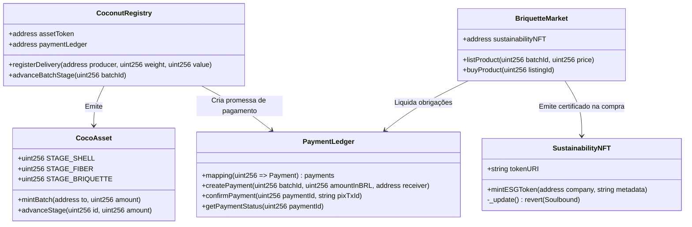

# Diagrama de Classes

Este diagrama ilustra a arquitetura dos Smart Contracts do ecossistema COINCONUT.

```mermaid
classDiagram
    class CoconutRegistry {
        +address assetToken
        +address paymentLedger
        +registerDelivery(address producer, uint256 weight, uint256 value)
        +advanceBatchStage(uint256 batchId)
    }

    class CocoAsset {
        +uint256 STAGE_SHELL
        +uint256 STAGE_FIBER
        +uint256 STAGE_BRIQUETTE
        +mintBatch(address to, uint256 amount)
        +advanceStage(uint256 id, uint256 amount)
    }

    class PaymentLedger {
        +mapping(uint256 => Payment) payments
        +createPayment(uint256 batchId, uint256 amountInBRL, address receiver)
        +confirmPayment(uint256 paymentId, string pixTxId)
        +getPaymentStatus(uint256 paymentId)
    }

    class BriquetteMarket {
        +address sustainabilityNFT
        +listProduct(uint256 batchId, uint256 price)
        +buyProduct(uint256 listingId)
    }

    class SustainabilityNFT {
        +string tokenURI
        +mintESGToken(address company, string metadata)
        -_update() : revert (Soulbound)
    }

    CoconutRegistry --> CocoAsset : Emite
    CoconutRegistry --> PaymentLedger : Cria promessa de pagamento
    BriquetteMarket --> SustainabilityNFT : Emite certificado na compra
    BriquetteMarket --> PaymentLedger : Liquida obrigações
```
