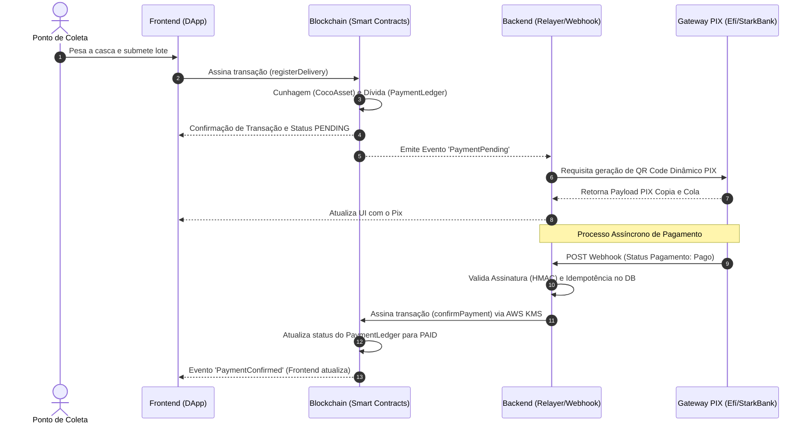

# Diagrama de Sequência

Este diagrama demonstra o fluxo completo desde o registro da pesagem até a compensação financeira via PIX e a atualização on-chain.

```mermaid
sequenceDiagram
    autonumber
    actor C as Ponto de Coleta
    participant F as Frontend (DApp)
    participant BC as Blockchain (Smart Contracts)
    participant B as Backend (Relayer/Webhook)
    participant P as Gateway PIX (Efí/StarkBank)

    C->>F: Pesa a casca e submete lote
    F->>BC: Assina transação (registerDelivery)
    BC->>BC: Cunhagem (CocoAsset) e Dívida (PaymentLedger)
    BC-->>F: Confirmação de Transação e Status PENDING
    BC-->>B: Emite Evento 'PaymentPending'
    B->>P: Requisita geração de QR Code Dinâmico PIX
    P-->>B: Retorna Payload PIX Copia e Cola
    B-->>F: Atualiza UI com o Pix
    
    Note over P, B: Processo Assíncrono de Pagamento
    P->>B: POST Webhook (Status Pagamento: Pago)
    B->>B: Valida Assinatura (HMAC) e Idempotência no DB
    B->>BC: Assina transação (confirmPayment) via AWS KMS
    BC->>BC: Atualiza status do PaymentLedger para PAID
    BC-->>F: Evento 'PaymentConfirmed' (Frontend atualiza)
```
