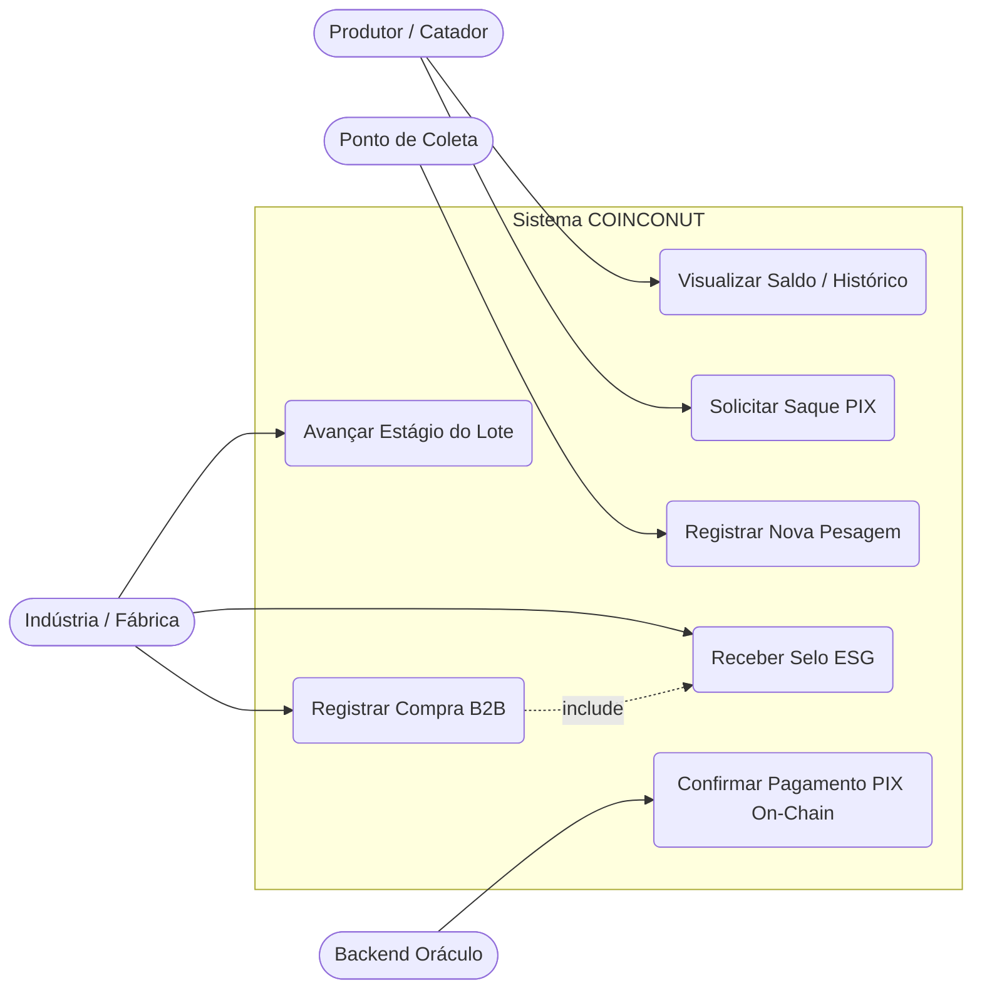

# Diagrama de Caso de Uso

Visualização dos atores (usuários e sistemas) e suas permissões/interações com os casos de uso da plataforma COINCONUT.

```mermaid
graph LR
    %% Atores
    Catador([Produtor / Catador])
    Coleta([Ponto de Coleta])
    Industria([Indústria / Fábrica])
    Oraculo([Backend Oráculo])

    %% Casos de Uso
    subgraph Sistema COINCONUT
        UC1(Visualizar Saldo / Histórico)
        UC2(Solicitar Saque PIX)
        UC3(Registrar Nova Pesagem)
        UC4(Avançar Estágio do Lote)
        UC5(Registrar Compra B2B)
        UC6(Receber Selo ESG)
        UC7(Confirmar Pagamento PIX On-Chain)
    end

    %% Relações
    Catador --> UC1
    Catador --> UC2
    
    Coleta --> UC3
    
    Industria --> UC4
    Industria --> UC5
    Industria --> UC6
    
    Oraculo --> UC7
    
    UC5 -.->|include| UC6
```
